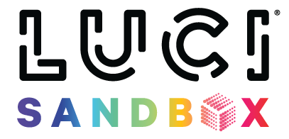

This is the public repo for the LUCI ROS2 SDK. 

All documentation for examples, packages, and use lives at https://lucimobility.github.io/luci-ros2-sdk-docs/

[Getting Started](docs/1_Getting-Started/1_getting-started.md)

[ROS2 Install](docs/2_Installation/1_ros-install.md)

[Installing Protobuf](docs/2_Installation/2_install-protobuf.md)

[Installing GRPC](docs/2_Installation/3_install-grpc.md)

[Installing SDK](docs/2_Installation/4_luci-ros2-sdk-install.md)

[Troubleshooting](docs/troubleshooting.md)

[Contributing](docs/CONTRIBUTING.md)
