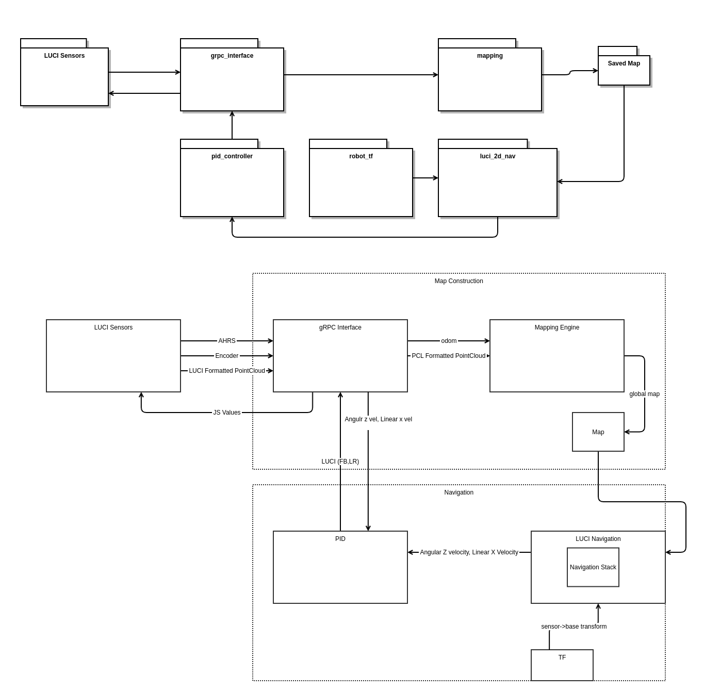
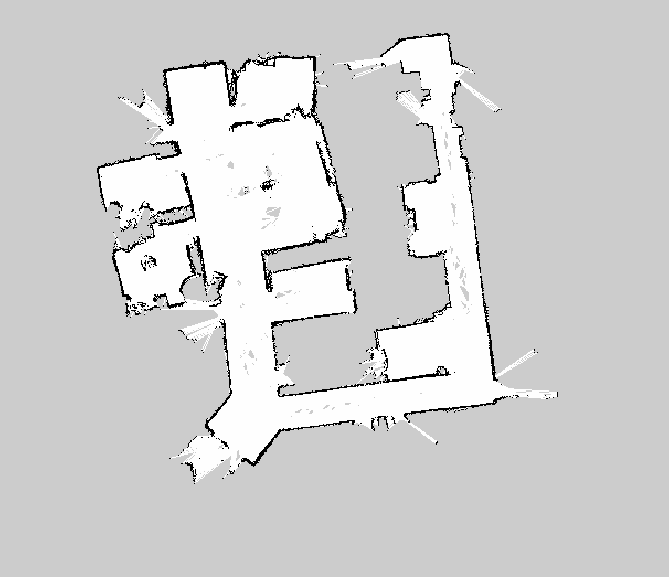

# SLAM (Simultaneous Localization and Mapping)

SLAM is a very useful application for autonomous or semi-autonomous robot navigation.

LUCI as a sensor platform allows for a jump start on applying a SLAM methodology to power wheelchairs.

While LUCI does not offer a existing SLAM package for the ROS2 SDK we have managed some level of prototype SLAM navigation ourselves.

In doing our own prototyping we have established a few tips for a successful navigation.

## Methods

There are multiple methods for SLAM
Listed in the table below are some of the methods we have tried or looked at and their pros and cons.

| Method                         | Pros                                                                                          | Cons                                 |
| ------------------------------ | --------------------------------------------------------------------------------------------- | ------------------------------------ |
| VSLAM (visual image landmarks) | Can be ran with no encoder, Can be used without imu, Resistent to the kidnapped robot problem | Struggles in featureless environment |
| GMapping                       | Quality 2D map                                                                                | AMCL Localization, LaserScan based   |
| Google Carographer             | Protobuf / gRPC compatible, 2D/3D Mapping, Aruco tag support                                  | High CPU load                        |
| RTabMap                        | RGB-D SLAM, Paired depth and tracking camera, Object detection                                | High CPU load                        |

## Testing done

LUCI has tested its ability to do SLAM with the following methods

- Lidar
- T265 Tracking camera
- Full LUCI PointCloud
- Camera only PointCloud
- AHRS only Odom
- Cartographer for localization
- Tuning AMCL
- RTabMap for localization
- Server side processing (VM)

## Packages

There are two main SLAM packages that have been successful with LUCI.

1. [slam_toolbox](http://wiki.ros.org/slam_toolbox)
2. [gmapping](http://wiki.ros.org/gmapping)

Both have their pros and cons but were able to be ran with LUCI data streams.

## Architecture

Here is the architecture design of what was tested at the LUCI offices and what the resulting map looked like

## Data

#### 2D vs 3D

While some of the SLAM nodes will expect a 2D point cloud and LUCI provides a 3D cloud you will need some method of converting our provided feed to 2D.
This can be done in a couple of ways.

1. Implement a z height flatten filter that casts all points to a single z height.
2. Run through an existing pointcloud->lidar converter node. This one proved decent.  
   [pointcloud_to_laserscan](https://github.com/ros-perception/pointcloud_to_laserscan)

<b>_Note: Not all SLAM nodes need 2D and 3D data is definitely the better choice to use for LUCI if able_</b>

Casting points to 2D produces a decent map but will struggle with localization later.

#### Ultrasonic Data

As LUCI produces ultrasonic curves as points it is recommended that you do <b>NOT</b> include them in the mapping of an environment as they will add curved noise to your map.

#### Odom

Odometry data is critical to the success of SLAM and while it can be found many ways the most common is with IMU and encoders.
LUCI does offer some Odom data through its onboard IMU but as all chairs that LUCI works with do <b>NOT</b> have wheel position sensors (_they operate on an open loop system_) LUCI is unable to offer any wheel position at this time.

## JS to Twist Message

As LUCI and wheelchairs operate with a left-right/forward-back joystick and SLAM packages expect a [Twist](http://docs.ros.org/en/melodic/api/geometry_msgs/html/msg/Twist.html) message a conversion node will be required.

Here are two different methods LUCI has played with to varying degrees of success that may be of help.

1. Find the max speed at a given speed setting then apply a linear fit mapping JS for 0-Max speed in a piece-wise function that is stepped based on speed settings.
2. Create a PID loop that takes in a chairs speed (already exposed through the luci_grpc_interface or ideally found from a more accurate source such as external encoders) as well as a goal speed and output a JS value of 0-100. This proved drive-able but does add an extra layer of tuning to your stack. This was ran as a “converter” node in between the SLAM node and the grpc-endpoint node.

We recommend the PID approach.
